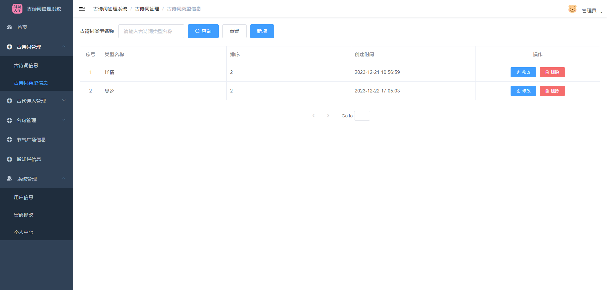

# 基于Java+Springboot+Vue古诗词微信小程序

# 获取地址

#### 作者QQ：3275035005 微信：xkbishe123 (支持修改、 部署调试、 代做接毕业设计和课程设计)

#### 接网站建设、小程序、H5、APP、各种系统、样式修改等

#### 选题+开题报告+任务书+程序定制+安装调试+论文+答辩ppt 都可以做

#### 问题包修改，包满意，有需求尽管甩过来！一条龙帮你安心过！

#### 所有项目以及源代码本人均调试运行无问题 可支持远程调试运行

#### 送万字文档，讲解视频，如需项目源码请添加联系方式。

## 1. 技术栈

技术架构：前后端分离     B/S架构    MVC架构

后端框架：Springboot + Mybatis

前端框架：Vue + ElementUI

小程序：微信原生语言

数据库：Mysql

开发工具：IDEA、微信开发者工具、Navicat 

第三方接口：百度云语音技术（诗词转化语音）

## 2. 功能概述

### 2.1 **管理员**

**登录、个人信息、修改密码**

**古诗词管理**：古诗词信息管理、古诗词类型信息管理

**古代诗人管理**：古代诗人信息管理、朝代信息管理

**名句管理**：名句管理、名句主题信息管理、名句类型信息管理

**节气广场信息管理**：节气广场信息

**通知栏信息管理**：通知栏信息

**系统管理**：用户管理、密码修改、个人中心

### 2.2 **用户**

**注册、登录、个人信息**

**系统首页数据概览**：推荐诗词查看，诗词、名句、诗人搜索，诗词信息、名句信息、诗人信息查看

**发现页面**：查看节气广场，通知栏

**我的页面**：诗词收藏，名句收藏，诗人收藏，头像修改，退出登录

## 3. 系统页面

### 3.1 用户

#### 登录

#### 注册

#### 首页

#### 首页搜索

#### 诗词查看

#### 诗词详情

#### 诗词朗读

#### 名句查看

#### 名句详情

#### 诗人查看

#### 诗人详情

#### 发现页面

#### 节气广场详情

#### 我的页面

### 3.2 **管理员**

#### 登录

#### 古诗词信息

#### 古诗词信息修改

#### 古诗词类型信息

#### 古代诗人信息

#### 朝代信息

#### 名句信息

#### 名句主题信息

#### 名句类型信息

#### 节气广场信息

#### 通知栏信息

#### 用户信息

#### 修改密码

#### 个人信息修改

